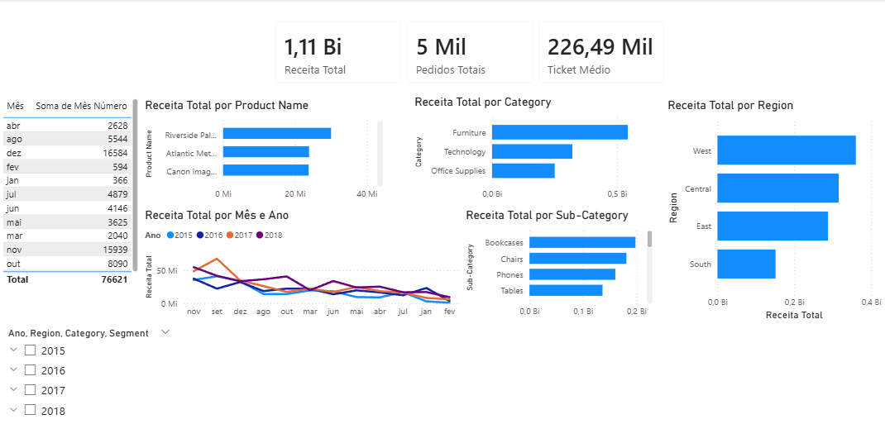

# 📊 Análise de Vendas com Python e Power BI

## 📌 Sobre o Projeto

Este projeto tem como objetivo analisar dados de vendas para extrair insights estratégicos que auxiliem na tomada de decisão.

A análise foi realizada em duas etapas:

* **Exploração e tratamento dos dados com Python**
* **Construção de um dashboard interativo no Power BI**

---

## 🎯 Objetivos

* Analisar o desempenho de vendas ao longo do tempo
* Identificar padrões e tendências de consumo
* Avaliar produtos, categorias e regiões mais lucrativas
* Criar visualizações claras e interativas para apoio à decisão

---

## 🛠️ Tecnologias Utilizadas

* Python (Pandas, Matplotlib, Seaborn)
* Power BI
* Jupyter Notebook
* Git e GitHub

---

## 📂 Estrutura do Projeto

```
analise-vendas/
│
├── data/
│   └── vendas.csv
│
├── notebooks/
│   └── analise_exploratoria.ipynb
│
├── dashboard/
│   └── dashboard.pbix
│
├── images/
│   └── dashboard_preview.png
│
├── requirements.txt
└── README.md
```

---

## 🔍 Etapas do Projeto

### 1. Coleta e Tratamento de Dados

* Importação do dataset de vendas
* Limpeza de dados (remoção de valores nulos e inconsistências)
* Ajuste de tipos (datas, números, texto)
* Criação de colunas auxiliares para análise temporal

---

### 2. Análise Exploratória com Python

* Cálculo de faturamento total
* Análise de vendas por período (mês/ano)
* Identificação de produtos mais vendidos
* Visualização de dados com gráficos

---

### 3. Dashboard no Power BI

O dashboard foi desenvolvido para facilitar a visualização dos dados e permitir análises interativas.

#### Principais elementos:

* **KPIs:**

  * Receita Total
  * Número de Pedidos
  * Ticket Médio

* **Gráficos:**

  * Vendas ao longo do tempo
  * Vendas por categoria e subcategoria
  * Top 10 produtos
  * Vendas por região e estado

* **Filtros interativos:**

  * Ano
  * Região
  * Categoria
  * Segmento

---

## 📈 Principais Insights

* Identificação de sazonalidade nas vendas ao longo dos meses
* Produtos com maior impacto na receita total
* Diferença de desempenho entre regiões
* Categorias com maior volume de vendas

---

## 📸 Preview do Dashboard



---

## ▶️ Como Executar o Projeto

### 1. Clonar o repositório

```
git clone https://github.com/RenanPBRBS/analise-vendas.git
```

### 2. Instalar dependências

```
pip install -r requirements.txt
```

### 3. Executar o notebook

```
jupyter notebook
```

---

## 📊 Dataset

O dataset utilizado contém informações de vendas, incluindo:

* Datas de pedidos
* Produtos
* Categorias
* Regiões
* Valores de vendas

[Kaggle](https://www.kaggle.com/datasets/rohitsahoo/sales-forecasting)

---

## 🚀 Possíveis Melhorias (a serem implementadas)

* Deploy do dashboard no Power BI Service
* Atualização automática dos dados
* Inclusão de análises preditivas
* Criação de API para consumo dos dados

---

## 👨‍💻 Autor

Projeto desenvolvido por **[Renan Candim]**

---
